**BASIC**


**Install software dependencies**


```

Install some basic software.

```
sudo apt-get install texlive-latex-base \
dvipng \
texlive-latex-extra \
texlive-xetex \
texlive-fonts-recommended
```


**run**

```bash
pdflatex gst_bill.tex

xelatex gst_bill.tex

```


**\usepackage{mathtools}**


```
\documentclass[preview, border=1pt, varwidth]{standalone}
\usepackage{mathtools}
\begin{document}
\[
(a+b)^2 = a^2 + 2ab + b^2
\]
\end{document}
```

[View math_0.tex](tex_math/math_0.tex)


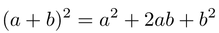 <p></p>


```
\cos(2\theta) = 1 - 2\sin^2\theta

```

[View math_1.tex](tex_math/math_1.tex)

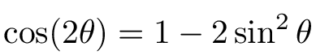 <p></p>


```
\[
c = a_1 \times b_1
\]
\[
\sqrt{16} = 4
\]
\[
\sqrt[3]{64} = 4
\]
\[
A \in B \neq \phi
\]
\[
\Bigg\{ A+ \bigg( B - \Big[ \big( C
\times D \big) / E \Big] \bigg) \Bigg\}
\]

```

[View math_2.tex](tex_math/math_2.tex)


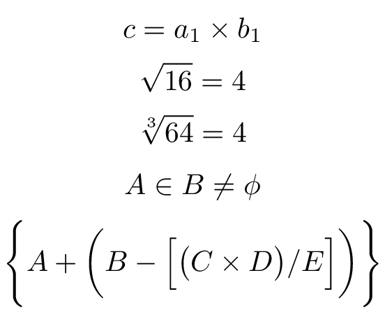 <p></p>


[View math_3.tex](tex_math/math_3.tex)


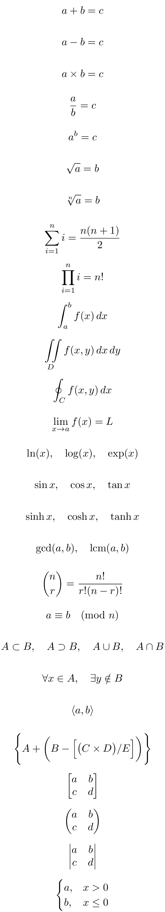 <p></p>


[View math_4.tex](tex_math/math_4.tex)


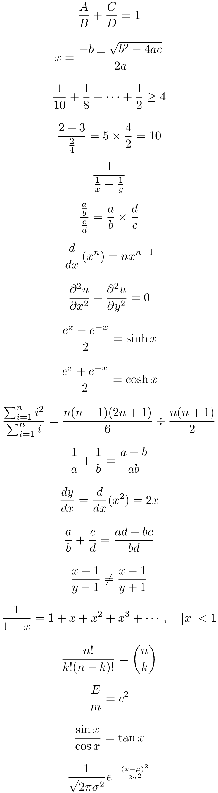 <p></p>


[View math_5.tex](tex_math/math_5.tex)


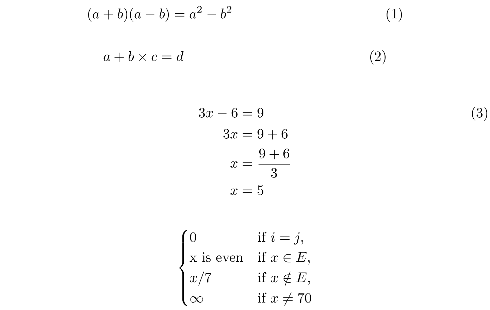 <p></p>


[View math_6.tex](tex_math/math_6.tex)


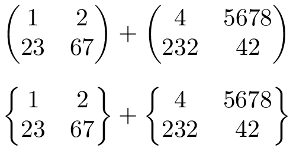 <p></p>

[View math_7.tex](tex_math/math_7.tex)


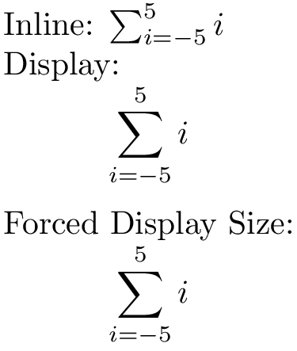 <p></p>


[View math_8.tex](tex_math/math_8.tex)


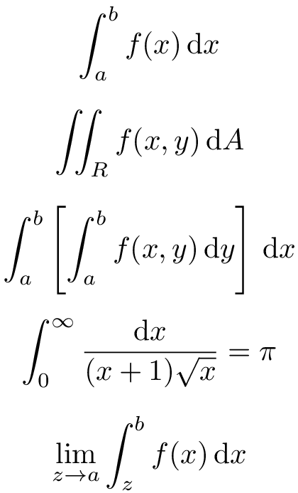 <p></p>


**Basic Table**


[View math_9.tex](tex_math/math_9.tex)


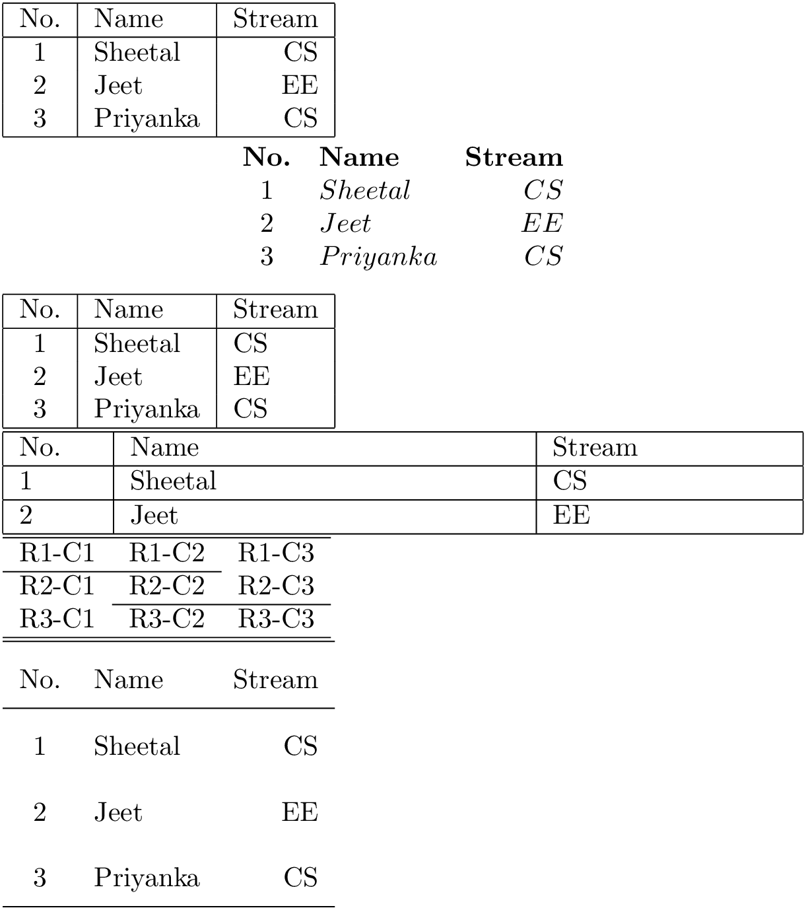 <p></p>


[View math_10.tex](tex_math/math_10.tex)


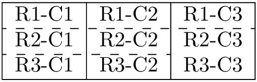 <p></p>


[View math_11.tex](tex_math/math_11.tex)


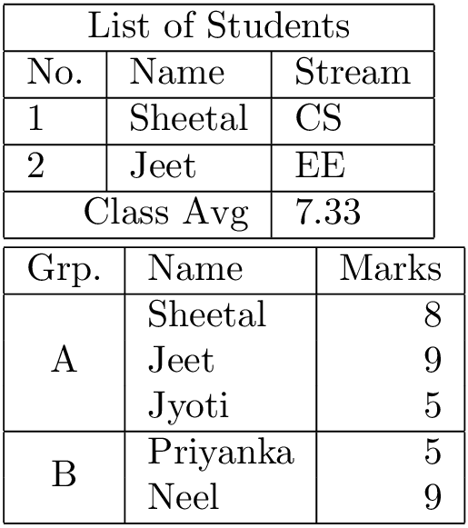 <p></p>


**Table Color**

[View math_12.tex](tex_math/math_12.tex)


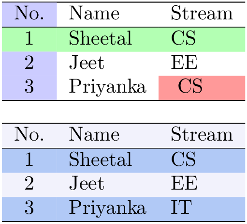 <p></p>


**Wrap Figures**

[View math_13.tex](tex_math/math_13.tex)


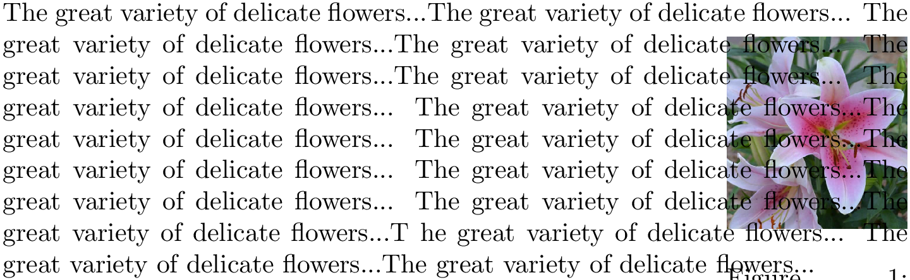 <p></p>


[View math_14.tex](tex_math/math_14.tex)


 <p></p>


**dingfill**

```
https://freeze.sh/_/2016/pifont/
```

[View math_15.tex](tex_math/math_15.tex)


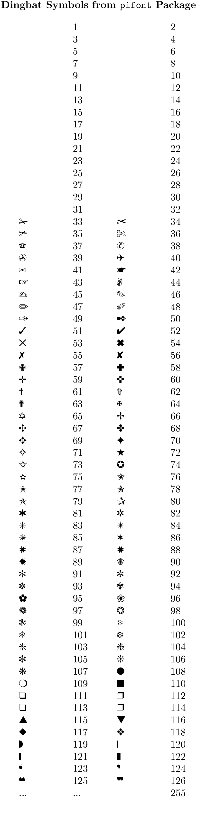 <p></p>