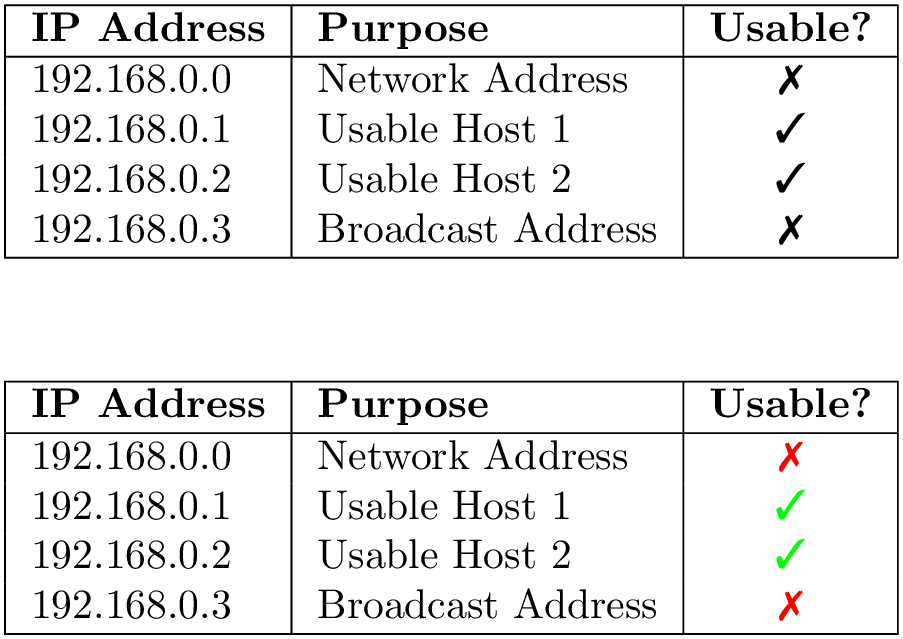

**BASIC**


```


https://en.wikipedia.org/wiki/PGF/TikZ
https://github.com/MartinThoma/LaTeX-examples/tree/master/tikz
https://github.com/MartinThoma/LaTeX-examples/tree/master
https://tex.stackexchange.com/questions/174806/how-can-i-create-a-template-for-2048-game-situations


https://github.com/topics/tikz


https://texample.net/periodic-table-of-chemical-elements/
https://texample.net/india-map/
https://texample.net/yellow-notes/
https://texample.net/more-tikz-timing-examples/
https://texample.net/difference-quotient/
https://texample.net/scientific-interactions/
https://texample.net/physical-pendulum/
https://texample.net/dva-vectors/
https://texample.net/morleys-triangle/
https://texample.net/cn4-points-of-intersection/
https://texample.net/archimedess-approximation-of-pi/
https://texample.net/dipolar-magnetic-field/
https://texample.net/nine-points-circle-of-a-triangle/
https://texample.net/rusting-iron/
https://texample.net/bode-plot/
https://texample.net/foldable-dodecahedron-with-calendar/
https://texample.net/observer-estimator/
https://texample.net/parameterised-pig/
https://texample.net/kalman-filter/
https://texample.net/line-plot-example/
https://texample.net/towers-of-hanoi/
https://texample.net/commutative-diagram/
https://texample.net/rgb-triangle/
https://texample.net/lindenmayer-systems/
https://texample.net/arithmetic-of-the-clock/
https://texample.net/christmas-tree-3/
https://texample.net/filesystem-tree/
https://texample.net/geometric-series/
https://texample.net/fiber-coupler/
https://texample.net/p2p-topology/
https://texample.net/family-tree/
https://texample.net/wankel-motor/
https://texample.net/framed-tikz/
https://texample.net/emoticons/
https://texample.net/highlighting-matrix/
https://texample.net/textronics-oscilloscope/
https://texample.net/bayes/
https://texample.net/sunset/
https://texample.net/sequence-diagram/
https://texample.net/complete-graph/
https://texample.net/cycle/
https://texample.net/commutative-diagram-tikz/
https://texample.net/refraction/
https://texample.net/labs-schema/
https://texample.net/cone/
https://texample.net/tux/
https://texample.net/hydrogen-splitting/


https://texample.net/work-breakdown-structure/

2d
https://texample.net/double-arrows/
https://texample.net/red-black-tree/
https://texample.net/fluor-energy-levels/
https://texample.net/kascade-map/
https://texample.net/raindrop/
https://texample.net/arrow-table/
https://texample.net/merge-sort-recursion-tree/
https://texample.net/rose-rhodonea-curve/
https://texample.net/periodic-boundaries-conditions/
https://texample.net/hypercycle/
https://texample.net/genaille-and-lucas-sticks/
https://texample.net/nested-grids-in-swan-and-wam-coupling/
https://texample.net/epc-flow-charts/
https://texample.net/andler-optimal-lot-size/
https://texample.net/porter-model/


https://texample.net/flowchart/
https://texample.net/smart-priority/
https://texample.net/coin-flipping/

EEE
https://texample.net/induction-machine/
https://texample.net/4-bit-counter/
https://texample.net/collpits/
https://texample.net/mosfet/
https://texample.net/or-gate/
https://texample.net/segment-display/
https://texample.net/poincare/
https://texample.net/seven-segment-display/
https://texample.net/series-and-parallel-graph-diagrams/
https://texample.net/gray-code-in-4-cube/
https://texample.net/tikz-timing/


ADNC
https://texample.net/rna-codons-table/


3D
https://texample.net/dandelin-spheres/
https://texample.net/terminals/
https://texample.net/escher-brick-penrose-triangle/
https://texample.net/coffee-cup/
https://texample.net/venn-diagram-blended/
https://texample.net/enderman/
https://texample.net/city/
https://texample.net/spherical-polar-pots-with-3dplot/
https://texample.net/annotated-3d-box/
https://texample.net/plane-partition/


MECH
https://texample.net/signpost/
https://texample.net/balance/
https://texample.net/noise-shaper/
https://texample.net/focused-ion-beam-system/
https://texample.net/spiderweb-diagram/
https://texample.net/intersecting-arcs/
https://texample.net/the-perrin-jablonski-diagram/
https://texample.net/marketing-distribution-channel/
https://texample.net/system-combination/


MATH
https://texample.net/logarithmic-spiral/
https://texample.net/principle-of-x-ray-photoelectron-spectroscopy-xps/
https://texample.net/mnemonic-rule-for-matrix-determinant/


NETWORK
https://texample.net/database-decimation-process/
https://texample.net/sankey-diagram/
https://texample.net/mesif/
https://texample.net/servers/


inbug
https://texample.net/supersonic-nozzle/


A4
https://texample.net/file-folder/
https://texample.net/torn-paper/
https://texample.net/colored-diagram/
https://texample.net/philosophy/
https://texample.net/bar-chart/
https://texample.net/model-diagram/
https://texample.net/karnaugh-diagram/
https://texample.net/lower-riemann-sum/
https://texample.net/polar-coordinates-template/
https://texample.net/tcp-state-machine/


Projects
https://github.com/varkor/quiver
https://github.com/yishn/tikzcd-editor
https://github.com/xiaohanyu/awesome-tikz?tab=readme-ov-file
https://github.com/PetarV-/TikZ


2D_COLUR
https://texample.net/totoro/


KIN
https://texample.net/three-link-annotated/
https://texample.net/three-link-manipulator/
https://texample.net/beamer-arrows/


py
https://github.com/nschloe/tikzplotlib

matlab
https://github.com/matlab2tikz/matlab2tikz
```


If you print on **A4 sheet (210 mm × 297 mm)**, the drawing will maintain a **1:1 scale** if you follow these steps:  

### **✅ Steps for Accurate Printout at 1:1 Scale**
1. **Use the provided LaTeX code** (with `scale=0.35278` to convert mm to TikZ units).  
2. **Compile using `pdflatex`** to generate a PDF.  
3. **Open the PDF in a viewer** (e.g., Adobe Acrobat, Evince, or Okular).  
4. **Set Print Scaling to "Actual Size" or "100%"** (Do **not** use "Fit to Page").  
5. **Use a ruler** after printing to check dimensions.  

### **📌 Output Size on A4**
- The **main rectangle (80 mm × 40 mm)** will print exactly as **80 mm × 40 mm**.  
- The **side extension (20 mm × 20 mm)** will also match.  
- All dimension lines and hole placements remain accurate.  

💡 **Tip**: If the drawing is too small on the A4 sheet, you can add `\clip (0,0) rectangle (210mm,297mm);` to ensure it aligns well within the A4 page.


**Install software dependencies**


```

Install some basic software.

```
sudo apt-get install texlive-latex-base \
dvipng \
texlive-latex-extra \
texlive-xetex \
texlive-fonts-recommended \
texlive-luatex \
texlive-science
```


**run**

```bash
pdflatex gst_bill.tex

xelatex gst_bill.tex

```


**\usepackage{mathtools}**


```
\documentclass[preview, border=1pt, varwidth]{standalone}
\usepackage{mathtools}
\begin{document}
\[
(a+b)^2 = a^2 + 2ab + b^2
\]
\end{document}
```

[View math_0.tex](tex_math/math_0.tex)


 <p></p>


```
\cos(2\theta) = 1 - 2\sin^2\theta

```

[View math_1.tex](tex_math/math_1.tex)

 <p></p>


```
\[
c = a_1 \times b_1
\]
\[
\sqrt{16} = 4
\]
\[
\sqrt[3]{64} = 4
\]
\[
A \in B \neq \phi
\]
\[
\Bigg\{ A+ \bigg( B - \Big[ \big( C
\times D \big) / E \Big] \bigg) \Bigg\}
\]

```

[View math_2.tex](tex_math/math_2.tex)


 <p></p>


[View math_3.tex](tex_math/math_3.tex)


 <p></p>


[View math_4.tex](tex_math/math_4.tex)


 <p></p>


[View math_5.tex](tex_math/math_5.tex)


 <p></p>


[View math_6.tex](tex_math/math_6.tex)


 <p></p>

[View math_7.tex](tex_math/math_7.tex)


 <p></p>


[View math_8.tex](tex_math/math_8.tex)


 <p></p>


**Basic Table**


[View math_9.tex](tex_math/math_9.tex)


 <p></p>


[View math_10.tex](tex_math/math_10.tex)


 <p></p>


[View math_11.tex](tex_math/math_11.tex)


 <p></p>


**Table Color**

[View math_12.tex](tex_math/math_12.tex)


 <p></p>


**Wrap Figures**

[View math_13.tex](tex_math/math_13.tex)


 <p></p>


[View math_14.tex](tex_math/math_14.tex)


 <p></p>


**dingfill**

```
https://freeze.sh/_/2016/pifont/
```

[View math_15.tex](tex_math/math_15.tex)


 <p></p>


[View math_16.tex](tex_math/math_16.tex)

 <p></p>